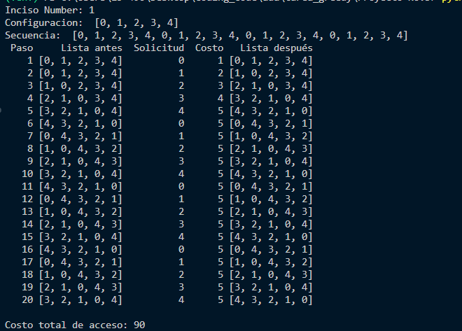
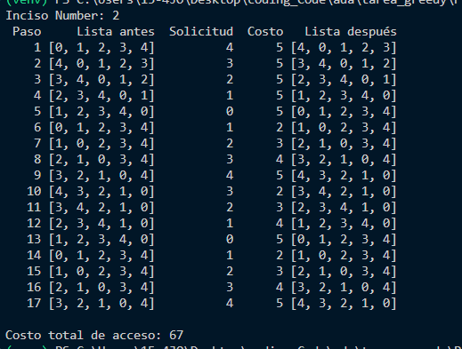
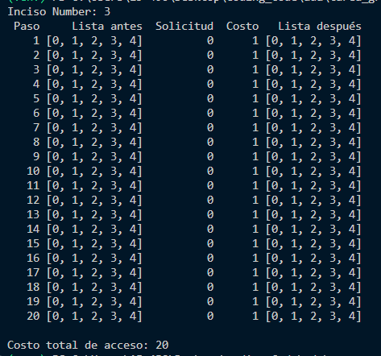
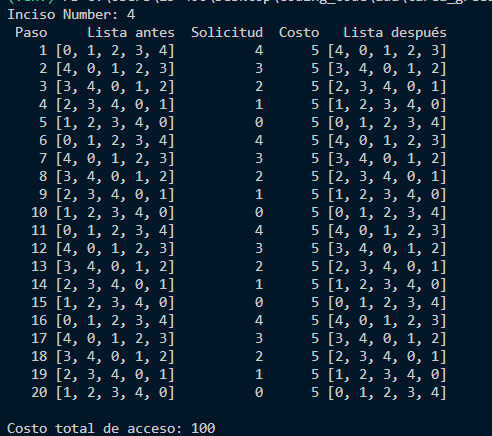
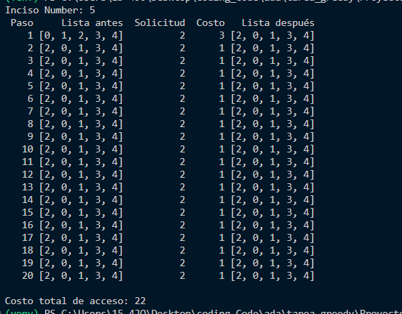
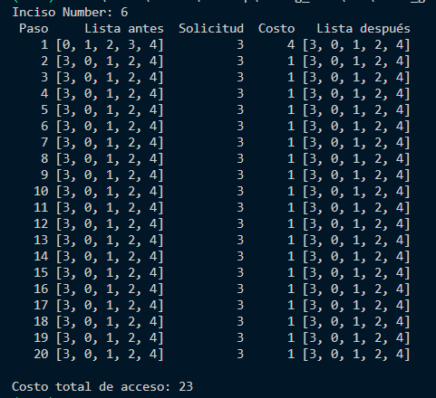
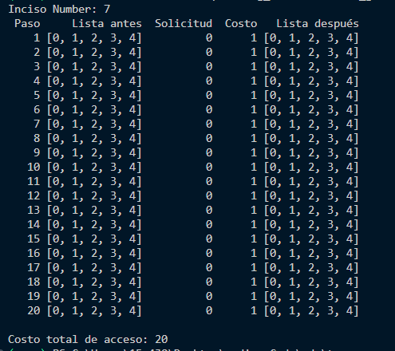
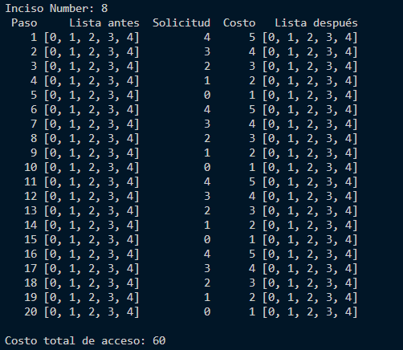

# Proyecto-No.3

1. Calcular el costo de acceso utilizando el algoritmo MTF para
    (a) Lista de configuraci ́on: 0, 1, 2, 3, 4
    (b) Secuencia de solicitudes: 0, 1, 2, 3, 4, 0, 1, 2, 3, 4, 0, 1, 2, 3, 4, 0, 1, 2, 3, 4

Imprima la lista de configuraci ́on, la solicitud, su costo y la configuraci ́on de la lista aplicando
MTF por cada solicitud en la secuencia y, al final, imprima el costo total de los accesos

2. Calcular el costo de acceso utilizando el algoritmo MTF para
    (a) Lista de configuración: 0, 1, 2, 3, 4
    (b) Secuencia de solicitudes: 4, 3, 2, 1, 0, 1, 2, 3, 4, 3, 2, 1, 0, 1, 2, 3, 4
Imprima la lista de configuración, la solicitud, su costo y la configuraci ́on de la lista aplicando
MTF por cada solicitud en la secuencia y, al final, imprima el costo total de los accesos.

3. ¿Para que secuencia de 20 solicitudes se obtiene el mínimo costo total de acceso utilizando el
algoritmo MTF para la configuración 0, 1, 2, 3, 4? ¿Cu ́al ser ́ıa ese costo total de acceso?

La secuencia min de acuerdo con en base a los dos secuencias propuestos en el inciso seria la secuencia donde el orden es mayor a menor hasta menor a mayor. Su costo para una secuencia de 20 solicitudes es 76 mientras que el costo para una secuncia que ordenada de menor a mayor 4 veces tiene un costo total de 90. 

Si quisiera obtener la secuencia mínima de 20 solicitudes seria una sequencia de los mismos numeros pero que sea la primera entrada de la configuración por lo tanto el mínimo puede ser un costo de 20 si la secuencia fuera solo ceros. 

## Best case secuencia de 0s

4. ¿Para qué secuencia de 20 solicitudes se obtiene el peor de los casos utilizando el algoritmo MTF para la configuración 0, 1, 2, 3, 4? ¿Cuál sería ese costo total de acceso?
Para una secuencia de 20 solicitudes, se observa que el mayor costo total de acceso seria 100 donde la secuencia empieza mayor al menor numero de la configuración por 4 veces donde cada valor de la secuencia tiene un costo de 5.
## Worst case secuencia ordenada de mayor a menor, repetidas veces

5. Calcular el costo de acceso utilizando el algoritmo MTF para
(a) Lista de configuración: 0, 1, 2, 3, 4
(b) Secuencia de solicitudes: 2, 2, 2, 2, 2, 2, 2, 2, 2, 2, 2, 2, 2, 2, 2, 2, 2, 2, 2, 2
Imprima la lista de configuración, la solicitud, su costo y la configuración de la lista aplicando
MTF por cada secuencia de solicitudes y al final el costo total de acceso, Si se hiciera la secuencia de solicitudes 3, 3, 3, 3, 3, 3, 3, 3, 3, 3, 3, 3, 3, 3, 3, 3, 3, 3, 3, 3, ¿cuál es el costo total de acceso? ¿Se observa algún patrón cuando hay una repetición de 20 elementos en la secuencia?

Para la secuencia de 2's, tenemos un total de costo por buscar en la configuración el número dos en la cual tiene un costo de tres. Al tener número en el primer indice, todos los costos de cada secuencia sería 1. Entonces el costo total es de 22. 

Para la secuencia de 3's es lo mismo solo que el costo por buscar el primer 3 es de 4 lo cual el costo de secuencia de 2's seria menor que este. (Costo total de la secuencia 3's es 23)

6. Se plantea un algoritmo mejorado de MTF: IMTF, por Rakesh Mohanty y Sasmita Tripathy, basado en el concepto de mirada hacia adelante (look-ahead). En este algoritmo, después de acceder al elemento en la posición i en la lista de configuración, se mueve el elemento al frente de la lista si y solo si dicho elemento aparece dentro de los próximos i – 1 elementos en la secuencia de solicitudes. En caso contrario, el elemento accedido no se mueve al frente de la lista de configuración. Imprimir la lista de configuración, la solicitud, su costo y la configuración de la lista aplicando IMTF por cada solicitud en la secuencia. Al final, imprimir el costo total de acceso usando IMTF para el mejor y el peor caso del algoritmo MTF.

Se observa que el best case siempre va a ser la cadena de 0's ya que es solo buscar en la primera posición lo cual en este caso sería n o 20 comolo plantea las demas secuencias vistas. Por otro lado, la sequencia del worst case al aplicar look ahead se reduce en algunos casos el costo a comparación de el algoritmo MTF, una secuencia de numeros ordenados de mayor a menor a cuantas veces sea tiene un costo de n*m que seria las m veces recorrida en la lista de configuración por las veces n veces de la secuencia. En este caso el costo es menor como se observa, su costo es de 60 y no de 100. 
## BEST CASE CASO DE 0s

## Worst case secuencia ordenada de mayor a menor, repetidas veces pero diferente costo
